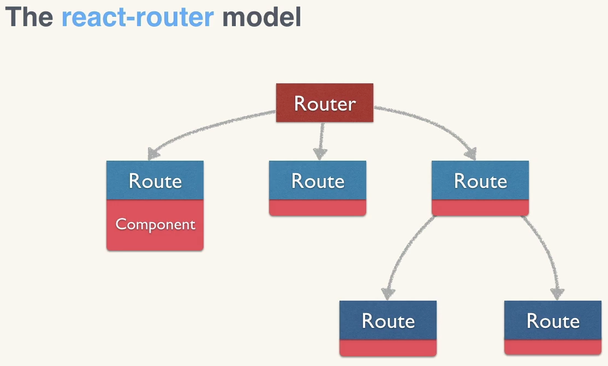
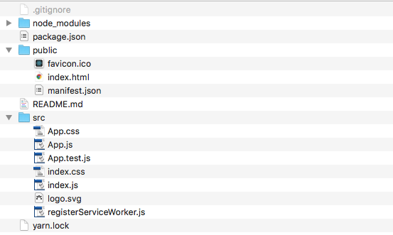

# ReactJS in the Batcave

* React is mostly the V in the MVC framework (The data is the **MODEL**, or the real world thing; The **VIEW** is how the reader interacts or sees your app; The **CONTROLLER** is the bridge between the **MODEL** and the **VIEW**, it decides what to do with input.)
* There are three building blocks in React:
    * Components
         - The very first thing that I should learn is how to write components
         - A component is either created stateless or with a state
            - if you're creating a stateless component then just use a normal JS function.
            ```JS
            function ClasslessComponent(props) {
                return(
                    <h1>{props.name}</h1>
                );
            }
            ReactDOM.render(
                <UserDetails name={name}/>,
                document.getElementById("app")
            )
            ```

            - if you're creating a component with a state then use a class.
            ```JS
            class classycomponent extends React.Component{
                render(){
                    return (
                        <h1>{this.props.name}</h1>
                    );
                }
            }
            ReactDOM.render(
                <classycomponent name={name}/>,
                document.getElementById("app")
            )
            ```
    **React components translate your raw data into Rich HTML, the props and state together build with that raw data to keep your UI consistent.**
    **Using props and state together helps you make an interactive app.**
    * State - Redux is used for managing application state.
        - A plain JS object
        - Triggered with render()
        - React manages the component state by calling setState(data,callback)
    * Props - properties
        - A plain JS object
        - Triggered with render()


### Keywords worth learning:
- Classes - Only use a class when you need to **manage state**.
- stateless functions - Try and make your components out of functions.
- tooling
- reducers
- routing
- smart and dumb components
- pure components
- asynchronous actions
- JSX
- events
- managing state
- passing props
- higher-order components
- lifecycle methods
- using third-party libraries
- single responsibility principle - Make things small
- React lifecycle methods
    - Get initial state - this.state
    - Get default props - this.props
    - componentWillMount
    - componentDidMount
    - componentWillReceiveProps(nextProps)
    - shouldComponentUpdate(nextProps, nextState)
    - componentWillUpdate(nextProps, nextState)
    - componentDidUpdate(prevProps, prevState)
    - componentWillUnmount
- React Router is the de facto routing solution



#### Coffee break notes
1. Functional components
    - Architect your components with the single-responsibility principle
    - Writing stateless components.

* The easiest way to just play around with react is to use the following boilerplate code:
```HTML
<html>
<head>
<script src="https://unpkg.com/react@15/dist/react.min.js"></script>
<script src="https://unpkg.com/react-dom@15/dist/react-dom.min.js"></script>
<script src="https://unpkg.com/babel-standalone@6.15.0/babel.min.js"></script>
<!-- We need babel so that we can use JSX-->
</head>
<body>
    <div id="app"></div>
    <script type="text/babel">
    /* 
    ADD REACT CODE HERE 
    */
    </script>
</body>
</html>
```

* The easiest way to setup a React environment to to use the create-react-app command

```Javascript
npm install -g create-react-app // installs create-react-app globally
create-react-app myapp // creates a react app called myapp
cd myapp // go into that directory

yarn start // starts the development server. ( compiles app, opens new browser, monitors changes to files)
yarn build // bundles the app into static files for production.
yarn test // starts the test runner.
```
Here are the files that are created when running create-react-app myapp


## Components
Everything in React is a component. They usually take the form of JavaScript classes. Here is a simple component which extends the react-component class. Once you create a component you should define its methods. In the example below we just want to render something on screen.

``` Javascript
class Hello extends React.Component{
    render(){
        return <h1>Hello!</h1>;
    }
}
//To use the component we use the ReactDOM.render() function.
ReactDOM.render(
    <Hello />, 
    document.getElementById("app")
);
```

## Props
Props are external way of passing data
``` Javascript
class Hello extends React.Component{
    render(){
        return <h1>Hello {this.prop.message}</h1>;
        // Here we have to tell JSX that we want to add a JS expression so we escape it.
    }
}
ReactDOM.render(
    <Hello message="my prop"/>, //component with the data
    document.getElementById("app") //DOM node to mount to
);
```

## State
The state can be changed by the component itself.

# Redux
Redux manages an application's state. Redux handles two states: one is the data state and the other is the UI state and it's a standard option for SPAs (single page applications). Redux can be used with AngularJS, jQuery, or with React JS libraries or frameworks.

Unidirectional data flow means that data flows in one direction: from the parent level to the child level. It's very difficult for two components in React to properly communicate.

The STORE is the single place where Redux stores all your states. If a component finds any changes, it has to dispatch to the STORE first and if other components require access, it has to Subscribe from the store. It cannot directly authorize communication with that component.

3 Principles of REDUX:
1. Single store approach
2. Read-only state
3. Reducer functions to change the state